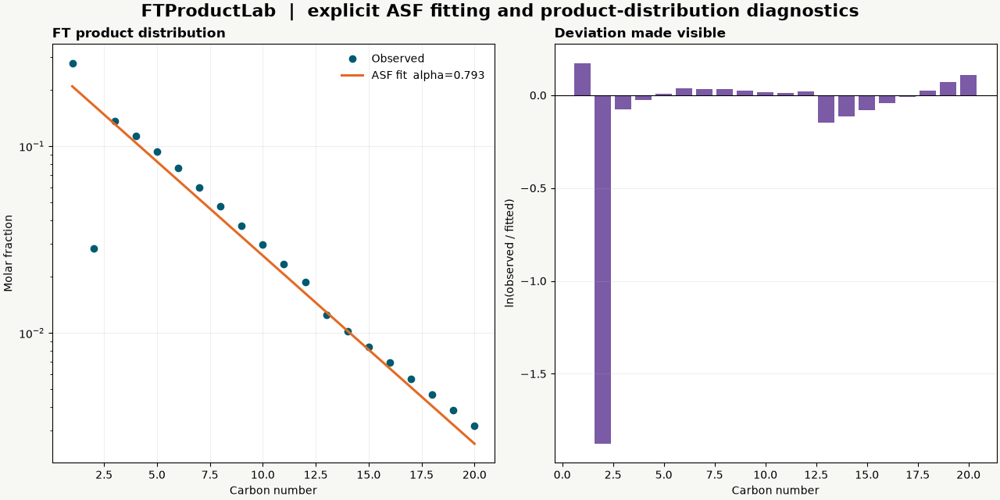

# FTProductLab

[](https://github.com/hdkim99/FTProductLab/actions/workflows/ci.yml)
[](https://github.com/hdkim99/FTProductLab/actions/workflows/macos.yml)
[](https://www.python.org/)

Reproducible Fischer–Tropsch carbon-number distribution, single-alpha ASF, product-cut,
deviation, and olefin/paraffin analysis.



## Why

FTProductLab keeps carbon-number definitions, input basis, fit range, regression weighting,
and truncation conventions visible. It does not turn a high R² into a claim that an ideal ASF
mechanism is valid. Species remain category-resolved while totals are aggregated by carbon
number for analysis.

## Install

```bash
python -m pip install ftproductlab
```

The base package contains the scientific core and CLI and has no GUI, Qt, or plotting
dependency. For figures and the Tk interface:

```bash
python -m pip install "ftproductlab[gui]"
```

Tk itself is supplied by Python, not PyPI. Homebrew Python users may need the matching
formula, for example `brew install python-tk@3.14`.

## 30-second example

```bash
ftproductlab analyze examples/sample_distribution.csv \
  --basis molar --fit-min 5 --fit-max 20 \
  --cut C1:1:1 --cut C2-C4:2:4 --cut C5+:5 \
  --output ftproductlab-output --plots
```

The command writes a machine-readable `analysis.json`, point/cut/O-P CSV tables, and
PNG/SVG/PDF figures. Run the built-in hand-checkable regression with:

```bash
ftproductlab validate
```

Python uses the same core:

```python
from ftproductlab import FitConfig, InputBasis, ProductRecord, analyze_distribution

records = [ProductRecord(n, 0.2 * 0.8 ** (n - 1)) for n in range(1, 21)]
result = analyze_distribution(records, InputBasis.MOLAR, FitConfig(3, 20))
assert abs(result.fit.alpha - 0.8) < 1e-12
```

## GUI

```bash
python -m ftproductlab.gui
```

The GUI is deliberately Tkinter/ttk rather than Qt. It creates one `Tk()` root, calls the
same application service as the CLI, exports the same tables, and closes the event loop
normally. Plot exports explicitly select Matplotlib `Agg`; the core and CLI do not import
Tkinter, Matplotlib, PyQt, or PySide.

## CSV schema and basis

Required columns are `carbon_number` and `amount`. Optional columns are `category`,
`species`, `molecular_weight_g_mol`, and `below_detection`.

- `molar`: amount is proportional to moles of product molecules.
- `carbon`: amount is proportional to carbon moles; it is divided by carbon number before
  fitting.
- `mass`: each record must provide molecular weight. FTProductLab never approximates all
  paraffins, olefins, and oxygenates as `CH2`.

Amounts may use any consistent scale. Zero measurements remain in output but cannot enter a
logarithmic fit. Below-detection records remain visible and are excluded from fitting by
default. Repeat `--cut LABEL:MIN[:MAX]` to define CLI cuts; the GUI exposes the same cut
specification, and the Python API accepts `CutDefinition` objects directly.

## Scientific basis

For molecular amount at carbon number `n`, the ideal single-alpha model is

```text
x_n = (1 - alpha) alpha^(n - 1)
```

and the corresponding carbon fraction is

```text
w_n = n (1 - alpha)^2 alpha^(n - 1).
```

FTProductLab estimates the slope of `ln(molar-equivalent amount)` against `n` over the
user-specified range; `alpha = exp(slope)`. The intercept is free because experimental
datasets may be scaled or truncated. Uniform and amount-weighted regressions are explicit
choices. No fit range is selected automatically, and C1/C2 are not silently removed.

The primary/statistical foundation is Flory's chain-length distribution
([JACS 1936, DOI 10.1021/ja01301a016](https://doi.org/10.1021/ja01301a016)); its early FT
application includes Friedel and Anderson
([JACS 1950, DOI 10.1021/ja01159a039](https://doi.org/10.1021/ja01159a039)). A modern
discussion of ideal ASF and structured deviations is
[Vervloet et al., Catalysis Science & Technology 2013](https://doi.org/10.1039/C3CY00080J).
See [the scientific-basis document](docs/scientific-basis.md) for conventions and equations.

## Validation

- Exact synthetic geometric distributions recover alpha to floating-point precision.
- Infinite molecular/carbon normalization and analytical carbon-cut sums have independent
  direct-summation tests.
- Species aggregation, mass-to-mole conversion, C1/C2 deviations, product-cut closure,
  O/P zero denominators, detection flags, CSV, CLI, GUI export, plotting, and import
  isolation are tested.
- The open-access Partington et al. Co/TiO2 study reports alpha=0.92 for C10–C40 and provides
  a useful external target, but repository-level numerical reproduction remains pending
  because a redistributable tabular C10–C40 fixture has not yet been extracted. Synthetic
  fixtures are never labeled real data.

Details: [validation record](docs/validation.md).

## Supported platforms

- Python 3.10–3.14 for the core and CLI
- Linux scientific core/CLI and Xvfb GUI checks on the project DGX runner
- macOS GUI workflow on GitHub-hosted macOS plus local Apple Silicon smoke testing
- Tk 8.6 or newer; no Qt binding is used or installed

The hosted GUI matrix covers Apple Silicon on Python 3.10 and 3.14 and Intel on Python
3.13. The `setup-python` 3.10 build on the `macos-15-intel` image is not a supported GUI
combination because its Tk 8.5 build metadata conflicts with the image's Tk 8.6 runtime.
See [macOS notes](docs/macos.md).

## Limitations

- Version 0.1 implements an ideal, single-alpha descriptive fit only. Dual-alpha and
  modified ASF models are intentionally unsupported.
- Missing products, detector response, phase collection, recycle, and analytical recovery
  can structure residuals; the software does not correct them without supplied data.
- Observed product-cut fractions close over the supplied dataset. They are not an estimate
  of an unmeasured heavy tail.
- Category names such as “gasoline”, “diesel”, and “wax” are not assigned automatically;
  carbon-number cut definitions are shown explicitly.
- This is product-distribution decision support, not a reactor or kinetic mechanism model.

## Development and citation

See [CONTRIBUTING.md](CONTRIBUTING.md) before changing an equation or GUI dependency and
use [CITATION.cff](CITATION.cff) when citing the software. The name and competitive audit is
recorded in [docs/naming-audit.md](docs/naming-audit.md).
